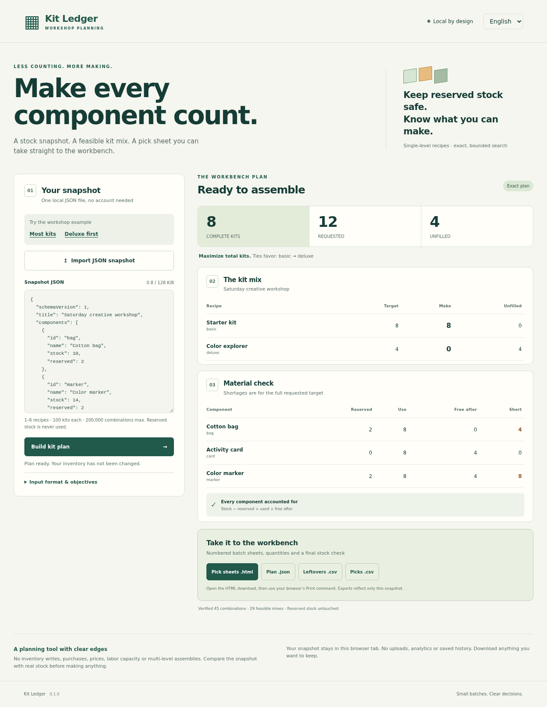

# Kit Ledger

**A stock snapshot. A feasible kit mix. A pick sheet for the workbench.**

Kit Ledger is a small, local planner for a workshop organizer assembling several kinds of kits from shared components. It answers a narrow question: *with these quantities and reservations, which whole kits can we make now?*

[日本語](README.ja.md) · [Input contract](docs/input-contract.md) · [Design and limitations](docs/design.md) · [Verification](docs/verification.md) · [Product positioning](docs/positioning.md)

## Preview



[Japanese desktop](docs/screenshots/desktop-ja.png) · [English mobile](docs/screenshots/mobile-en.png) · [Japanese mobile](docs/screenshots/mobile-ja.png)

These are inspected screenshots from the [verified implementation run](https://github.com/Masanori-Spec/kit-ledger/actions/runs/37141178947), which passed 100 tests on each of Node 22/24 and all 11 sandboxed browser scenarios. [Exact tested commit and evidence](docs/verification.md).

## What it does

- Reads a single-level recipe and stock snapshot as JSON
- Protects reserved stock and respects each recipe's requested upper bound
- Finds an exact feasible mix within an explicit, small search domain
- Lets the objective favor total kit count or an explicit recipe priority order
- Shows shortages for the **full requested target**, not just the chosen mix
- Produces numbered batch pick sheets, leftover-stock CSV, picks CSV and a JSON report
- Includes a per-component conservation check and the normalized input in the report
- Shares one dependency-free engine between a bilingual browser UI and a Node CLI

This is planning, not an inventory transaction. It does not place orders, change stock, manage accounts, schedule workers, estimate profit, track lots, or expand nested assemblies.

## A trade-off you can see

The example has 8 available bags and 12 available markers after reservations. Starter kits need 1 marker; deluxe kits need 3. The target is 8 starter kits and 4 deluxe kits.

| Objective | Starter | Deluxe | Total |
|---|---:|---:|---:|
| Maximize completed kits | 8 | 0 | 8 |
| Prioritize deluxe, then starter | 0 | 4 | 4 |

Both plans are feasible. They answer different questions. Priority mode does **not** mean a weighted preference or maximum total with a tie-break; it maximizes the first recipe before considering the next.

For the full target, 4 bags and 8 markers are missing. The chosen plan's unused markers are still shown as free stock. Reservations are never treated as available.

## Quick start

Use Node.js 22 or 24; CI targets both versions. Runtime planning has no third-party dependencies.

```sh
node src/cli.mjs examples/workshop.json
node src/cli.mjs examples/workshop.json --out ./my-new-plan --lang ja
```

The output directory must be new and its parent must already exist. Existing directories and files are never overwritten. It contains `plan.json`, `leftovers.csv`, `picks.csv`, and `pick-sheets.html`. Open the HTML in your browser and print it using the normal Print command. The HTML contains no JavaScript or remote assets.

To use the browser UI:

```sh
node scripts/build.mjs
node scripts/serve.mjs
# Open http://127.0.0.1:4176
```

Use an HTTP server rather than opening the application HTML as a `file:` URL: module workers require an appropriate origin. The first view runs the included fictional example. Import your own snapshot or edit the JSON, then choose **Build kit plan**. Editing, importing, cancellation and errors clear old results and exports. English and Japanese are available from the header.

The app makes no runtime API calls and stores no snapshot in cookies, localStorage, sessionStorage or IndexedDB. Serving the application naturally transfers its static code/assets; planning and exports happen locally in the tab. The supplied development server only binds to `127.0.0.1`. Download anything you want to retain.

## Exact, with explicit limits

| Limit | Value |
|---|---:|
| Input | 128 KiB, UTF-8 JSON |
| Recipes | 1–6 |
| Stock components | 1–100 |
| Requested count per recipe | 0–100 |
| Stock per component | 0–1,000,000,000 |
| Quantity per recipe component | 1–1,000,000 |
| Candidate count | product of `(requested + 1)`, at most 200,000 |
| Browser worker lifetime | 8 seconds |

All quantities must use plain integer JSON literals, such as `12`, not `12.0` or `1.2e1`. Duplicate JSON keys, unknown fields, unknown component references, duplicate IDs, fractions, negative zero and unsafe values are rejected.

A search beyond the candidate limit is refused **before enumeration**. There is no heuristic fallback, truncation or partially optimized export. A cancelled or timed-out browser run produces no plan. The optimizer enumerates the entire accepted domain, including infeasible combinations; `visited` therefore equals `candidateCount` for every completed report.

## Development and tests

```sh
npm ci --ignore-scripts
npm run check
npm run benchmark
npx playwright install --with-deps chromium
npm run test:browser
```

`npm run check` runs core/CLI tests, syntax checks, formatting checks and the static build. The independent oracle uses mixed-radix enumeration and an exact integer score rather than the production engine's recursive comparator. Browser tests exercise real workers and downloads as well as controlled delayed/failure flows.

CI runs Node 22/24 and sandbox-enabled Chromium on Ubuntu 22.04. See [verification](docs/verification.md) for what has actually run, including the local browser restriction and the runner's 2027 retirement date. A workflow file is not evidence of a successful CI run.

## Review before making anything

A mathematically feasible plan can still be wrong if the snapshot is stale or the real materials do not match the recipe. Check stock, units and quantities at the workbench. Conservation verifies arithmetic, not physical inventory, product suitability, safety or regulatory compliance.
